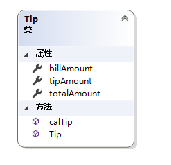
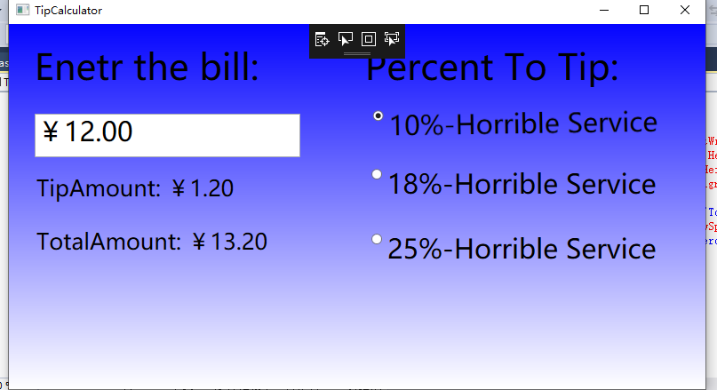
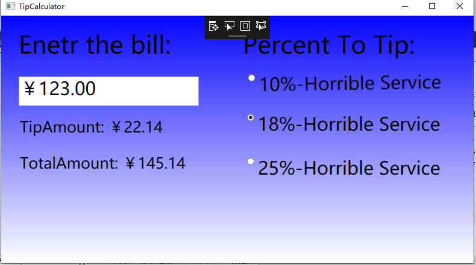
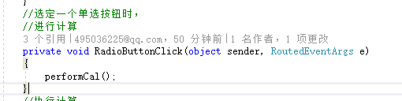
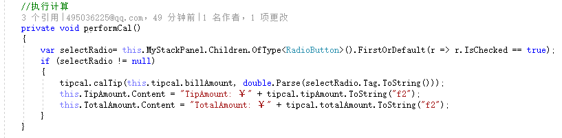

# TipCalculator
##作业简介：
一个wpf桌面应用程序，计算小费，用户输入账单数，根据服务的等级计算小费和总账单
##细节：
1.新建一个Tip类，保存账单数据，同时，根据不同的percent计算小费和总账单;

2.在MainWindow.cs下设计界面，界面运行如图所示

其中，在白色的TextBox中输入bill，只允许输入数字，当输入完成之后，按下回车键，则TextBox中的数字格式化为人民币表示形式，且只保留到小数点后两位。接下来，当选定某一单选框时，就会计算小费并显示。
##收获：
1.对于单选框按下时的事件，之前是想写三个类似的事件代码，虽然觉得会造成代码冗余，不够简洁，但是也没想到合适的解决方法，后来看了视频中的做法，可以将三个事件整合在一起，值得学习和借鉴。

2.本此作业中，对xaml有了更加深刻的理解和认识。
3.我觉得在用户在输入结束后按下回车键之后，如果单选框已经被选中，应该计算出结果并展示结果，之前一直没想明白要怎么做，后来发现只要在keyDown事件中判断是否有选中的按钮即可。
##不足：
1.界面设计比较粗糙，不够整洁；
2.对控件没有进行合理的包装。